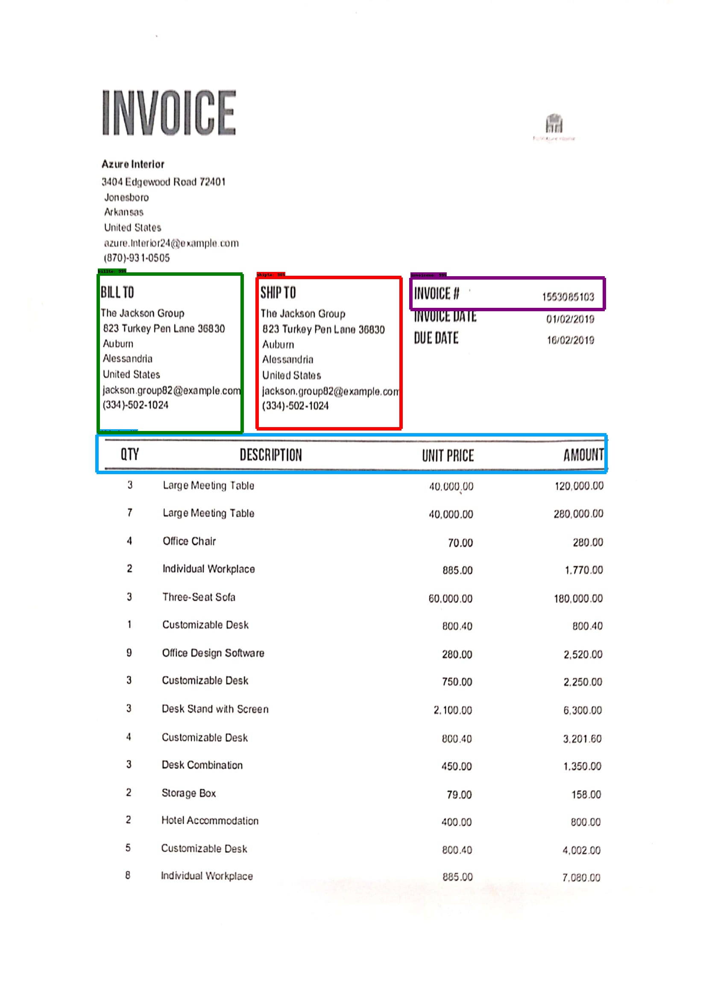

# Docmaster using Tensorflow object detection api

Docmaster is a deep learning model to detect field items like "Ship to", "Bill to", "Invoice Number" and table header from the invoice documents. 

  

The model has been trained with generic invoice templates downloaded from various websites and labeled using LabelImg python package.

For building this model i took the referrence of the github page : https://github.com/EdjeElectronics/TensorFlow-Object-Detection-API-Tutorial-Train-Multiple-Objects-Windows-10

The above steps mentioned was for windows rather i used Google colab for my model to train as they provide free GPU and TPU machines to train the models.

In this research, I used fast_rcnn model for training as it is fast and gives better accuracy for object detection use cases.

# How to run this model

- To run my model you need to clone the entire directory and make a folder structure models/research/object_detection. Put the entire code in that folder.

- Open the Object_Detection.ipynb file in your google colab.

- Edit -> Notebook settings -> Choose GPU under Hardware Accelator

- Ensure all the cells execute without any error

- Open the Docmaster.ipynb file in your google colab

- Execute all the cells you will get the results for the default test image

# Test your own file

- Upload a sample invoice image document in your drive under the object_detection folder
- Change the corresponding filename in the Object_detection_image.py 
- Execute the Docmaster.ipynb notebook again you will get the results in the result.jpeg file created in your drive

# Future work

- As invoice is a sensitive data there is no proper dataset available for training the model.
- So need to find a way to synthesize or simulate own invoice with disorientation, noise and label those images and train the model
- As of now we just get field items for "Ship To" and "Bill to" but in future we need to gather all possible keywords like "Billed to", "Consignee to" etc and simulate those invoices too and generate training samples for better accuracy of our model
